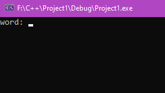
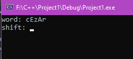
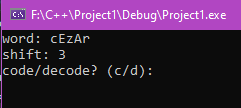
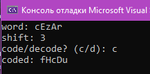

### Описание назначения
программа кодирует и декодирует сообщение, вводимое пользователем.
пользователь сам может выбирать шаг, на который будет шифроваться / расшифрововаться его сообщение.
можно использовать любые буквы английского алфавита.
***
### Запуск программы
после запуска программы, пользователю сразу предлагается ввести сообщение для дальнейших действий.
 - программа сразу предлагает ввести сообщения для шифровки/расшифровки.
***
### Выполнение основных функций
затем пользователь вводит шаг, на который будет кодироваться / декодироваться сообщение.
после этого программа предлагает пользователю выбор : шифровать или расшифровать введенное им сообщение.
***
 - далее нужно ввести нужный вам шифровальный сдвиг.
***
 - затем нужно выбрать зашифровать/расшифровать введенное вами сообщение.
***
### Завершение программы
Вывод результатов в соответствии с веденными данными
***
 - вывод результата/конец программы.
