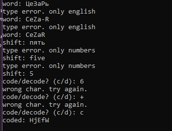
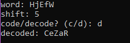

### Описание назначения
программа кодирует и декодирует сообщение, вводимое пользователем.
пользователь сам может выбирать шаг, на который будет шифроваться / расшифрововаться его сообщение.
можно использовать любые буквы английского алфавита
***
### Запуск программы
после запуска программы, пользователю сразу предлагается ввести сообщение для дальнейших действий.
затем пользователь вводит шаг, на который будет кодироваться / декодироваться сообщение.
после этого программа предлагает пользователю выбор : шифровать или расшифровать введенное им сообщение.

### Пример работы программы (Скриншоты)
 - пример шифрования.
***
 - пример расшифровки текста.
